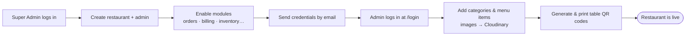
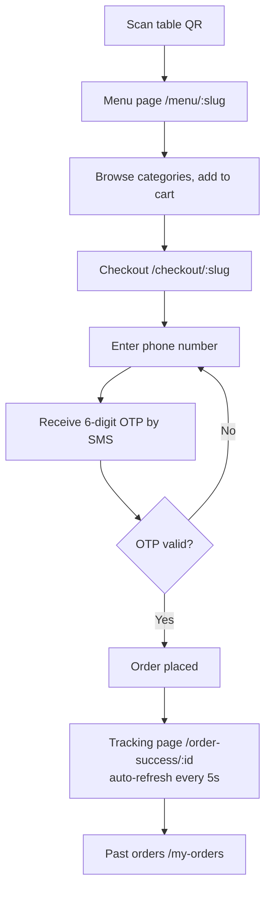
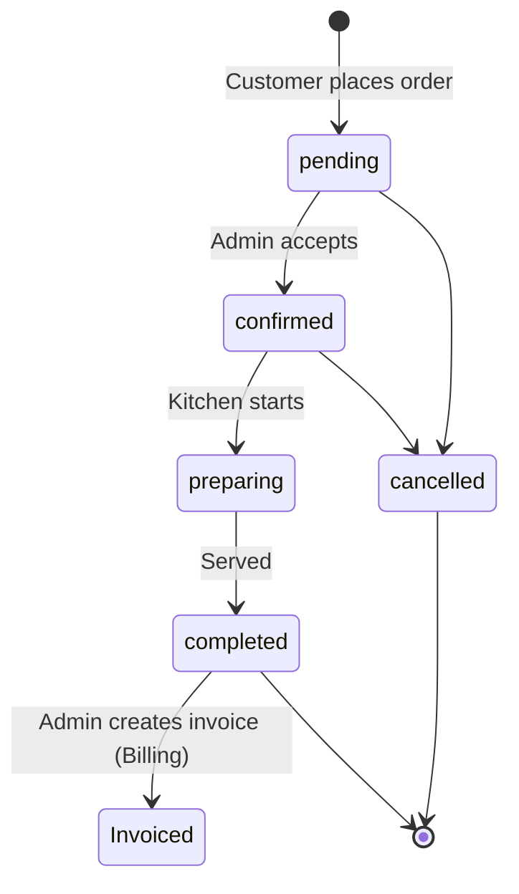
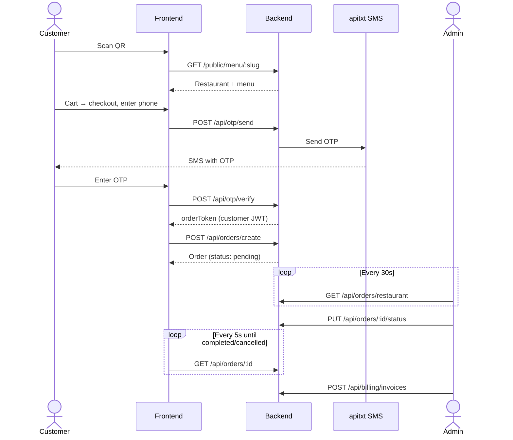
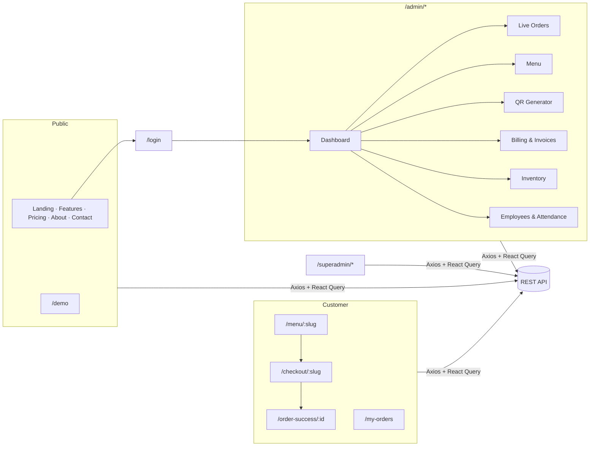
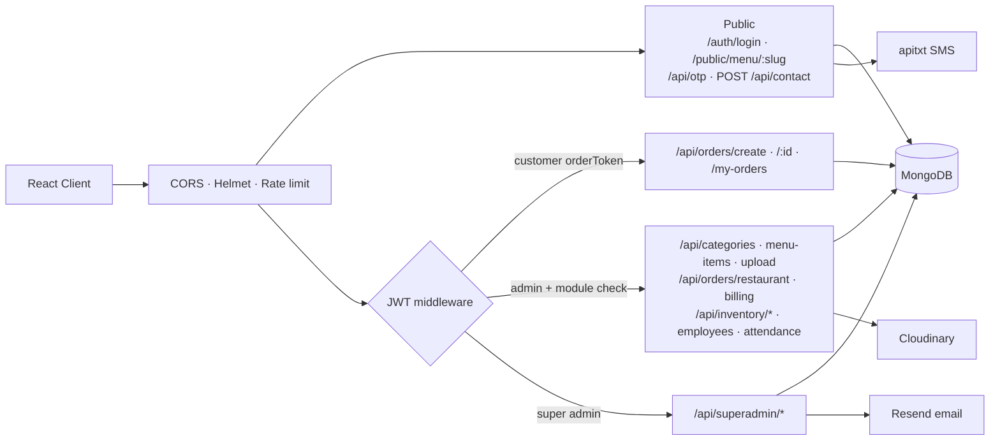

# ScanIt — QR Menu & Restaurant SaaS

Multi-tenant platform where restaurants publish a QR menu, take OTP-verified orders, and run operations (orders, billing, inventory, staff) from one admin dashboard. Each restaurant's data is isolated by `restaurantId`, and modules (orders, billing, inventory…) are enabled per restaurant by the Super Admin.

## Tech Stack

| Layer    | Stack |
|----------|-------|
| Frontend | React 19, Vite, MUI 7, React Router 7, TanStack Query, Axios |
| Backend  | Node.js, Express 5, MongoDB + Mongoose, JWT, Helmet, rate limiting |
| Services | Cloudinary (images), apitxt.com (OTP SMS), Resend (emails) |

## Roles

| Role        | Entry point        | Can do |
|-------------|--------------------|--------|
| Super Admin | `/superadmin-login` | Onboard restaurants, manage admins & enabled modules, view platform stats, inquiries |
| Admin (restaurant) | `/login` | Menu, QR codes, live orders, billing, inventory, employees & attendance |
| Customer    | Scan table QR → `/menu/:slug` | Browse, order with OTP, track order, view past orders |

---

## User Flows

### 1. Restaurant onboarding

Self-registration is disabled; restaurants are created by the Super Admin.



### 2. Customer ordering



### 3. Order lifecycle (Admin)



### 4. End-to-end request sequence



---

## Architecture

### Frontend



### Backend



---

## Getting Started

**Prerequisites:** Node.js 18+, a MongoDB database (local or Atlas), and Cloudinary / apitxt / Resend accounts.

### 1. Backend

```bash
cd server
npm install
```

Create `server/.env`:

```env
PORT=5000
MONGODB_URI=mongodb://localhost:27017/scanit
JWT_SECRET=change-me
CORS_ORIGIN=http://localhost:5173

CLOUDINARY_CLOUD_NAME=
CLOUDINARY_API_KEY=
CLOUDINARY_API_SECRET=

API_TXT_API_KEY=            # OTP SMS
RESEND_API_KEY=             # emails
RESEND_FROM_EMAIL=
INQUIRY_TO_EMAIL=           # where contact-form inquiries go

SA_EMAIL=admin@example.com  # Super Admin created by the seed script
SA_PASSWORD=change-me
```

Create the Super Admin, then start the API:

```bash
npm run seed        # add -- --reset to overwrite the password
npm start           # http://localhost:5000
```

### 2. Frontend

```bash
cd client
npm install
```

Create `client/.env`:

> **API URL:** the base URL is set in `client/src/environment.js`. It currently points to production (`https://api-scanit.nestsphere.in`). To use your local backend, switch it to the commented `VITE_API_URL` / `localhost:5000` line.

```env
VITE_API_URL=http://localhost:5000
# Firebase / analytics
VITE_FIREBASE_API_KEY=
VITE_FIREBASE_AUTH_DOMAIN=
VITE_FIREBASE_PROJECT_ID=
VITE_FIREBASE_STORAGE_BUCKET=
VITE_FIREBASE_MESSAGING_SENDER_ID=
VITE_FIREBASE_APP_ID=
```

```bash
npm run dev         # http://localhost:5173
npm run build       # production build → client/dist
```

### 3. First run

1. Open `http://localhost:5173/superadmin-login` and log in with `SA_EMAIL` / `SA_PASSWORD`.
2. Create a restaurant and its admin, and enable the modules it needs.
3. Log in at `/login` as that admin, add a menu, and generate QR codes.
4. Open `/menu/<restaurant-slug>` (or scan the QR) to place a test order.

## Project Structure

```text
client/src/
  pages/        Public, customer, admin, super-admin screens
  components/   Shared UI
server/
  routes/       REST endpoints (auth, orders, billing, inventory…)
  models/       Mongoose schemas
  middleware/   Admin / super-admin / customer JWT guards
  config/       Cloudinary, SMS provider
  seed.js       Super Admin bootstrap
```
