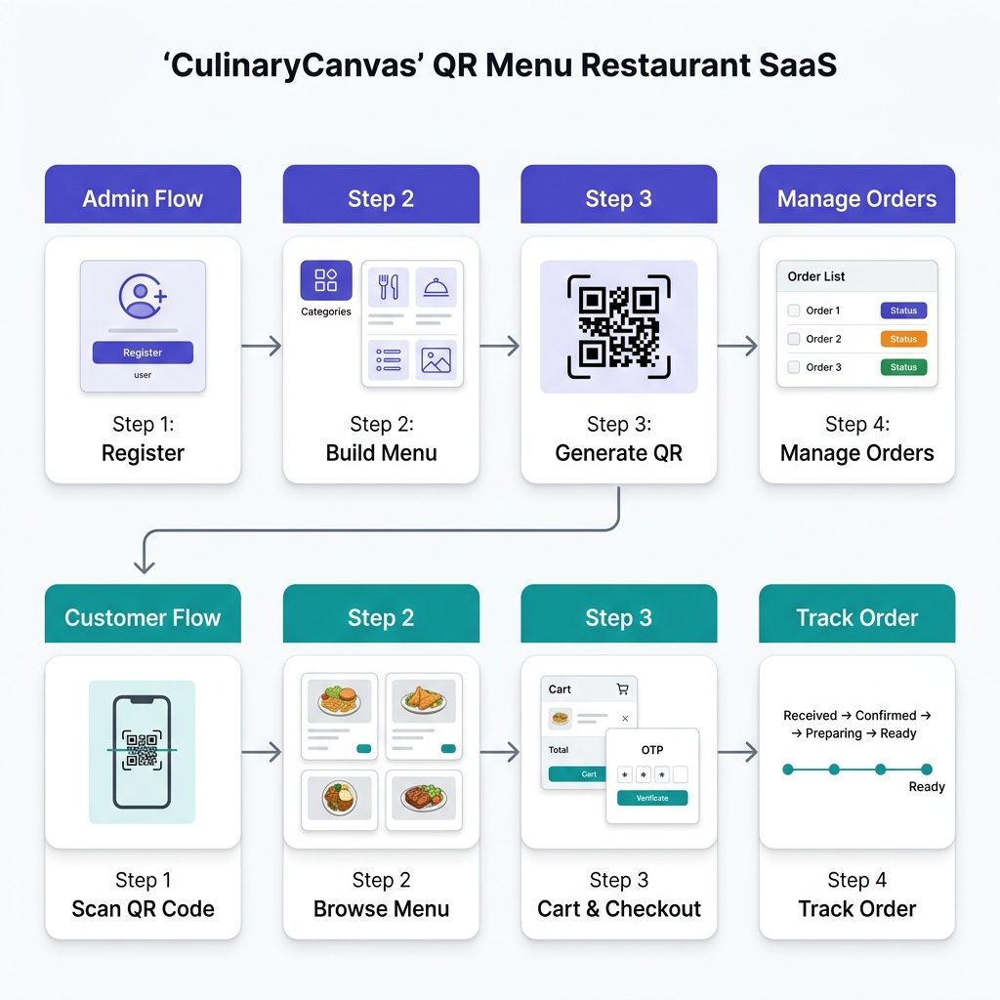

# User Flows — CulinaryCanvas

This document describes the end-to-end user journeys for both **Restaurant Admin** and **Customer** personas.

## User Flow Diagram



---

## Table of Contents

- [System Architecture Overview](#system-architecture-overview)
- [Flow 1: Admin Onboarding](#flow-1-admin-onboarding)
- [Flow 2: Admin Menu Management](#flow-2-admin-menu-management)
- [Flow 3: Customer Ordering](#flow-3-customer-ordering)
- [Flow 4: Admin Order Management](#flow-4-admin-order-management)
- [Flow 5: Demo Mode (Sales Pitch)](#flow-5-demo-mode-sales-pitch)
- [API Integration Map](#api-integration-map)
- [Multi-Tenant Data Isolation](#multi-tenant-data-isolation)

---

## System Architecture Overview

```
┌───────────────────────────────────────────────────────────────────────┐
│                        CulinaryCanvas SaaS                           │
├──────────────────────────┬────────────────────────────────────────────┤
│     FRONTEND (React)     │          BACKEND (Express + MongoDB)       │
│                          │                                            │
│  ┌────────────────────┐  │  ┌──────────────────────────────────────┐  │
│  │   Landing Page      │  │  │  Auth Routes (/auth)                │  │
│  │   Login / Register  │──┼──│    POST /register                   │  │
│  │                     │  │  │    POST /login                      │  │
│  └────────────────────┘  │  └──────────────────────────────────────┘  │
│                          │                                            │
│  ┌────────────────────┐  │  ┌──────────────────────────────────────┐  │
│  │   Admin Dashboard   │  │  │  Admin Routes (protected)           │  │
│  │   ├─ Dashboard      │──┼──│    /api/categories (CRUD)           │  │
│  │   ├─ Menu           │  │  │    /api/menu-items (CRUD)           │  │
│  │   ├─ Orders         │  │  │    /api/orders/restaurant           │  │
│  │   ├─ Analytics      │  │  │    /api/orders/:id/status           │  │
│  │   └─ QR Codes       │  │  │    /api/upload                     │  │
│  └────────────────────┘  │  └──────────────────────────────────────┘  │
│                          │                                            │
│  ┌────────────────────┐  │  ┌──────────────────────────────────────┐  │
│  │   Public Menu       │  │  │  Public Routes (no auth)            │  │
│  │   ├─ Menu View      │──┼──│    GET /public/menu/:slug           │  │
│  │   ├─ Cart           │  │  │                                     │  │
│  │   ├─ Checkout       │──┼──│  Customer Routes (OTP token)        │  │
│  │   └─ Order Tracking │  │  │    POST /api/otp/send-otp           │  │
│  │                     │  │  │    POST /api/otp/verify-otp         │  │
│  └────────────────────┘  │  │    POST /api/orders/create           │  │
│                          │  │    GET  /api/orders/:id              │  │
│                          │  └──────────────────────────────────────┘  │
│                          │                                            │
│                          │  ┌──────────────────────────────────────┐  │
│                          │  │  External Services                   │  │
│                          │  │    Cloudinary (image storage)        │  │
│                          │  │    MongoDB (database)                │  │
│                          │  └──────────────────────────────────────┘  │
└──────────────────────────┴────────────────────────────────────────────┘
```

---

## Flow 1: Admin Onboarding

**Persona:** Restaurant Owner signing up for the first time.

```
┌─────────┐     ┌───────────┐     ┌────────────────┐     ┌──────────────┐
│  User   │────▶│  Landing  │────▶│  Register Page │────▶│  Admin       │
│  visits │     │  Page (/) │     │  (/register)   │     │  Dashboard   │
│  site   │     │           │     │                │     │  (/admin)    │
└─────────┘     └───────────┘     └────────────────┘     └──────────────┘
                  │                  │                      │
                  │ Clicks           │ Fills form:          │ Sees:
                  │ "Get Started"    │ • Restaurant name    │ • Empty dashboard
                  │                  │ • URL slug           │ • "Add Category"
                  │                  │ • Email              │ • "Add Item"
                  │                  │ • Password           │ • QR code button
                  │                  │                      │
                  │                  │ API calls:           │ Stored in localStorage:
                  │                  │ POST /auth/register  │ • token
                  │                  │                      │ • user { restaurantId,
                  │                  │ Returns:             │   restaurantName,
                  │                  │ • JWT token          │   slug, email }
                  │                  │ • restaurantId       │
                  │                  │ • slug               │
```

**Steps:**
1. User lands on `/` — sees hero, features, pricing
2. Clicks **"Get Started"** or **"Start Free Trial"** → navigates to `/register`
3. Fills in Restaurant Name, URL Slug, Email, Password
4. Frontend calls `POST /auth/register`
5. Backend creates Restaurant + Admin records, returns JWT with `restaurantId`
6. Frontend stores `token` and `user` in localStorage
7. Redirects to `/admin` — empty dashboard, ready to build menu

---

## Flow 2: Admin Menu Management

**Persona:** Restaurant Owner building their digital menu.

```
┌──────────────────────────────────────────────────────────────────┐
│                    Admin Dashboard (/admin)                       │
│                                                                  │
│  ┌─ Sidebar ─────┐  ┌─ Content ──────────────────────────────┐  │
│  │                │  │                                        │  │
│  │  Dashboard     │  │  STEP 1: Add Categories                │  │
│  │  ► Menu        │  │  ┌──────────┐ ┌──────────┐            │  │
│  │  Orders        │  │  │ Starters │ │ Desserts │ [+ Add]    │  │
│  │  Analytics     │  │  └──────────┘ └──────────┘            │  │
│  │  QR Codes      │  │  API: POST /api/categories             │  │
│  │                │  │                                        │  │
│  │  ─────────     │  │  STEP 2: Add Menu Items                │  │
│  │  Settings      │  │  ┌──────────────────────────────────┐  │  │
│  │  Support       │  │  │ [Image]  Paneer Tikka    ₹249   │  │  │
│  │                │  │  │ [Image]  Butter Chicken  ₹350   │  │  │
│  │  ─────────     │  │  │ [+ Add Item]                     │  │  │
│  │  👤 Admin      │  │  └──────────────────────────────────┘  │  │
│  │     Logout     │  │  API: POST /api/menu-items             │  │
│  │                │  │       POST /api/upload (image)         │  │
│  └────────────────┘  │                                        │  │
│                      │  STEP 3: Generate QR Code               │  │
│                      │  ┌────────────────┐                    │  │
│                      │  │  ██████████    │ URL:               │  │
│                      │  │  ██ QR ██ ██  │ /menu/your-slug    │  │
│                      │  │  ██████████    │                    │  │
│                      │  └────────────────┘                    │  │
│                      │  Print this and place on tables!       │  │
│                      └────────────────────────────────────────┘  │
└──────────────────────────────────────────────────────────────────┘
```

**API calls during menu management:**

| Action | Method | Endpoint |
|--------|--------|----------|
| List categories | GET | `/api/categories` |
| Add category | POST | `/api/categories` |
| Edit category | PUT | `/api/categories/:id` |
| Delete category | DELETE | `/api/categories/:id` |
| List menu items | GET | `/api/menu-items` |
| Add menu item | POST | `/api/menu-items` |
| Edit menu item | PUT | `/api/menu-items/:id` |
| Delete menu item | DELETE | `/api/menu-items/:id` |
| Upload image | POST | `/api/upload` |

> All scoped by `req.admin.restaurantId` — admin can only see/edit their own restaurant's data.

---

## Flow 3: Customer Ordering

**Persona:** Restaurant customer scanning a QR code from the table.

```
  SCAN QR          VIEW MENU           ADD TO CART        CHECKOUT
  ────────         ─────────           ───────────        ────────

  ┌────────┐      ┌──────────────┐    ┌──────────────┐   ┌──────────────────┐
  │  📱    │      │ ┌──────────┐ │    │ Paneer  ×2   │   │ Order Summary     │
  │  Scan  │─────▶│ │ Starters │ │    │ Naan    ×4   │   │ ─────────────     │
  │  QR    │      │ │ Mains    │ │    │              │   │ Subtotal:  ₹558   │
  │  Code  │      │ │ Desserts │ │    │ Cart: ₹558   │   │ GST (5%):  ₹28   │
  └────────┘      │ └──────────┘ │    │ [View Cart]  │   │ Total:     ₹586   │
                  │              │    └──────────────┘   │                   │
  Opens:          │ Butter       │                       │ ┌───────────────┐ │
  /menu/:slug     │ Chicken ₹350 │    Cart stored in     │ │ Phone: 98765  │ │
                  │ [+ Add]      │    localStorage       │ │ [Send OTP]    │ │
  API:            │              │                       │ └───────────────┘ │
  GET /public/    └──────────────┘                       │                   │
  menu/:slug                                             │ API:              │
                                                         │ POST /api/otp/    │
                                                         │ send-otp          │
                                                         └──────────────────┘

  VERIFY OTP                     ORDER PLACED              TRACK ORDER
  ──────────                     ────────────              ───────────

  ┌──────────────────┐          ┌────────────────────┐   ┌────────────────────┐
  │ OTP Sent!         │          │ 🎉 Order Placed!   │   │ Estimated ready in │
  │                   │          │                    │   │                    │
  │ Enter 4-digit     │          │ Order #CC-A1B2C3   │   │    12:45           │
  │ code: [1234]      │─────────▶│                    │   │                    │
  │                   │          │ Paneer Tikka  ×2   │   │ ● Order Received   │
  │ [Verify & Place   │          │ Butter Naan   ×4   │   │ ● Confirmed ✅     │
  │  Order]           │          │ ──────────────     │   │ ◐ Preparing 👨‍🍳    │
  │                   │          │ Total: ₹586        │   │ ○ Ready            │
  └──────────────────┘          └────────────────────┘   │                    │
                                                         │ Polls every 5s     │
  API calls:                     API calls:               │ GET /api/orders/:id│
  POST /api/otp/verify-otp      POST /api/orders/create  └────────────────────┘
  Returns: orderToken            Returns: order with _id
                                 Clears cart
```

**Full API sequence:**

| Step | API Call | Auth |
|------|----------|------|
| 1. Load menu | `GET /public/menu/:slug` | None |
| 2. Send OTP | `POST /api/otp/send-otp` | None |
| 3. Verify OTP | `POST /api/otp/verify-otp` | None → Returns `orderToken` |
| 4. Place order | `POST /api/orders/create` | `Bearer <orderToken>` |
| 5. Track order | `GET /api/orders/:id` | None (polled every 5s) |

---

## Flow 4: Admin Order Management

**Persona:** Restaurant staff managing incoming orders in real-time.

```
┌──────────────────────────────────────────────────────────────────┐
│  Admin Dashboard → Orders Section                                │
│                                                                  │
│  ┌─ Order #A1B2C3 ─────────────────────────────────────────────┐ │
│  │  12:45 PM • 9876543210                      ⚡ PENDING      │ │
│  │                                                              │ │
│  │  2× Paneer Tikka                                            │ │
│  │  4× Butter Naan                                             │ │
│  │  ──────────────                                             │ │
│  │  ₹586                              [Accept] [Cancel]        │ │
│  └──────────────────────────────────────────────────────────────┘ │
│                              │                                   │
│                    Click "Accept"                                 │
│                    PUT /api/orders/:id/status { status: confirmed}│
│                              │                                   │
│                              ▼                                   │
│  ┌─ Order #A1B2C3 ─────────────────────────────────────────────┐ │
│  │  12:45 PM • 9876543210                     ✅ CONFIRMED     │ │
│  │  ...                                                        │ │
│  │  ₹586                          [Start Prep] [Cancel]        │ │
│  └──────────────────────────────────────────────────────────────┘ │
│                              │                                   │
│                    Click "Start Prep"                            │
│                    PUT /api/orders/:id/status { status: preparing}│
│                              │                                   │
│                              ▼                                   │
│  ┌─ Order #A1B2C3 ─────────────────────────────────────────────┐ │
│  │  12:45 PM • 9876543210                     👨‍🍳 PREPARING    │ │
│  │  ...                                                        │ │
│  │  ₹586                              [Ready] [Cancel]         │ │
│  └──────────────────────────────────────────────────────────────┘ │
│                              │                                   │
│                    Click "Ready"                                 │
│                    PUT /api/orders/:id/status { status: completed}│
│                              │                                   │
│                              ▼                                   │
│  ┌─ Order #A1B2C3 ─────────────────────────────────────────────┐ │
│  │  12:45 PM • 9876543210                     🎉 COMPLETED     │ │
│  │  ...                                                        │ │
│  │  ₹586                                                       │ │
│  └──────────────────────────────────────────────────────────────┘ │
└──────────────────────────────────────────────────────────────────┘
```

**Order Status Lifecycle:**

```
  pending ──▶ confirmed ──▶ preparing ──▶ completed
     │            │             │
     └────────────┴─────────────┴──▶ cancelled
```

**Real-time features:**
- Dashboard polls `GET /api/orders/restaurant` every **10 seconds**
- 🔔 Browser sound notification plays when a new order arrives
- Customer's tracking page polls `GET /api/orders/:id` every **5 seconds**

---

## Flow 5: Demo Mode (Sales Pitch)

**Persona:** You (the seller) pitching CulinaryCanvas to a potential restaurant client.

```
  ┌────────────────────────────────────────────────────┐
  │  No backend needed! Full flow works with           │
  │  static data from demoData.js                      │
  │                                                    │
  │  Visit: /menu/demo                                 │
  │                                                    │
  │  1. Show the menu (Harvest Grain Bowl, etc.)       │
  │  2. Add items to cart                              │
  │  3. Go to checkout → Enter any phone number        │
  │  4. OTP sends instantly (bypassed)                 │
  │  5. Enter any OTP → Order placed!                  │
  │  6. Show order tracking with countdown timer       │
  │                                                    │
  │  ⚠️ Remove demo logic before production launch    │
  └────────────────────────────────────────────────────┘
```

---

## API Integration Map

Complete mapping of which frontend page calls which API:

```
┌─────────────────────┬────────────────────────────────────────────────┐
│ Frontend Page        │ API Endpoints Used                            │
├─────────────────────┼────────────────────────────────────────────────┤
│ LandingPage          │ None (static content)                         │
├─────────────────────┼────────────────────────────────────────────────┤
│ Login                │ POST /auth/login                              │
├─────────────────────┼────────────────────────────────────────────────┤
│ Register             │ POST /auth/register                           │
├─────────────────────┼────────────────────────────────────────────────┤
│ PublicMenu           │ GET /public/menu/:slug                        │
├─────────────────────┼────────────────────────────────────────────────┤
│ Checkout             │ POST /api/otp/send-otp                        │
│                      │ POST /api/otp/verify-otp                      │
│                      │ POST /api/orders/create                       │
├─────────────────────┼────────────────────────────────────────────────┤
│ OrderSuccess         │ GET /api/orders/:id (poll 5s)                 │
├─────────────────────┼────────────────────────────────────────────────┤
│ AdminDashboard       │ GET /api/categories                           │
│  └─ Dashboard        │ GET /api/menu-items                           │
│                      │ GET /api/orders/restaurant (poll 10s)         │
│  └─ Menu             │ POST/PUT/DELETE /api/categories               │
│                      │ POST/PUT/DELETE /api/menu-items               │
│                      │ POST /api/upload                              │
│  └─ Orders           │ GET /api/orders/restaurant                    │
│                      │ PUT /api/orders/:id/status                    │
│  └─ QR Codes         │ None (generated client-side via qrcode.react)│
└─────────────────────┴────────────────────────────────────────────────┘
```

---

## Multi-Tenant Data Isolation

Every piece of data in the system is scoped to a `restaurantId`:

```
                    ┌─────────────────┐
                    │   Restaurant A  │
                    │   id: "abc123"  │
                    └────────┬────────┘
                             │
           ┌─────────────────┼─────────────────┐
           │                 │                  │
    ┌──────▼──────┐   ┌─────▼──────┐   ┌──────▼──────┐
    │ Categories  │   │ Menu Items │   │   Orders    │
    │ restaurantId│   │ restaurantId│   │ restaurantId│
    │ = "abc123"  │   │ = "abc123" │   │ = "abc123"  │
    └─────────────┘   └────────────┘   └─────────────┘

                    ┌─────────────────┐
                    │   Restaurant B  │
                    │   id: "xyz789"  │
                    └────────┬────────┘
                             │
           ┌─────────────────┼─────────────────┐
           │                 │                  │
    ┌──────▼──────┐   ┌─────▼──────┐   ┌──────▼──────┐
    │ Categories  │   │ Menu Items │   │   Orders    │
    │ restaurantId│   │ restaurantId│   │ restaurantId│
    │ = "xyz789"  │   │ = "xyz789" │   │ = "xyz789"  │
    └─────────────┘   └────────────┘   └─────────────┘
```

**Security layers:**
1. JWT token embeds `restaurantId`
2. Frontend sends `X-Restaurant-Id` header
3. Backend middleware validates header matches admin's DB record
4. Every DB query filters by `restaurantId`

> Restaurant A's admin can NEVER see Restaurant B's data, even if they manipulate API calls.
